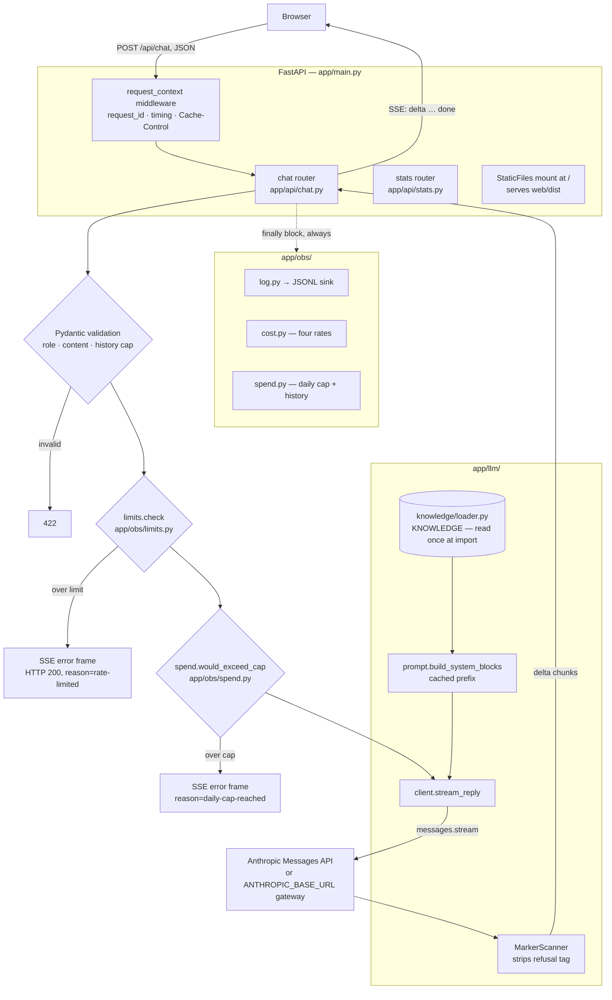

# SPECIFICATION — Cadre AI Support Chatbot

Technical specification of the system as built, derived by reading the code in this repository.
Every non-obvious claim cites a file path. Statements I could not verify from source are collected
in [§13 Assumptions / unverified](#13-assumptions--unverified) rather than asserted here.

**Commit at time of writing:** `b7c7753` · **System prompt:** v1.9 · **Corpus SHA-256 (12):**
`b76e58eff516`

---

## 1. Overview

A customer-support chatbot for Cadre AI, an AI strategy consultancy. It answers a bounded set of
questions about the company from a hand-curated corpus that is committed to the repository and read
once at process start — **the running application never queries the web or a vector store.**

Its defining behaviour is refusal: anything outside the corpus (pricing, client-portal credentials,
podcast episode content, named clients) is declined and routed to `https://www.cadreai.com/contact`.
Refusals are **structural, not prose** — the model emits a `[[refusal:<slug>]]` marker that the
server strips before display and converts into a `status` / `refusal_reason` pair on both the log
record and the response stream, making "how often does it refuse, and why" a queryable number.

It ships as a single deployable: FastAPI serves both the JSON/SSE API and the compiled React bundle.

---

## 2. Tech stack

### Backend — `pyproject.toml`, `requirements.txt`

| | Version constraint | Locked version |
|---|---|---|
| Python | `>=3.12` (`requires-python`) | 3.12 image in `Dockerfile:20` |
| `fastapi` | `>=0.115` | `0.141.1` |
| `uvicorn[standard]` | `>=0.32` | `0.52.0` |
| `anthropic` | `>=0.40` | `0.120.2` |
| `python-dotenv` | `>=1.0` | `1.2.2` |

**Four runtime dependencies.** Dev group (`dependency-groups.dev`): `pytest>=8.3`,
`pytest-asyncio>=1.4`, `httpx2>=0.1`, `ruff>=0.8`, `mcp>=1.0`.

`mcp` is dev-only by design — `tests/test_mcp.py:140` asserts `mcp_server` never appears in the
`Dockerfile`, and `tests/test_requirements.py` asserts it never appears in `requirements.txt`.

### Frontend — `web/package.json`

`react@^18.3.1`, `react-dom@^18.3.1`; build via `vite@^6.0.7` and `@vitejs/plugin-react@^4.3.4`.
**Two runtime dependencies.** No router, no component library, no CSS-in-JS, no markdown library —
`tests/test_ui.py::test_no_markdown_library_was_added` enforces the last of these.

### LLM provider

Anthropic Messages API via the official `anthropic` SDK. Two models are registered in
`app/llm/models.py`:

| | `claude-haiku-4-5` (default) | `claude-sonnet-5` |
|---|---|---|
| Context window | 200,000 | 1,000,000 |
| Max output | 64,000 | 128,000 |
| **Cache floor** | **4,096** | **1,024** |
| Rates $/MTok (in, out, cache-write, cache-read) | 1.00, 5.00, 1.25, 0.10 | 3.00, 15.00, 3.75, 0.30 |
| `thinking` parameter | `None` (not sent) | `{"type": "disabled"}` |

`DEFAULT_MODEL = HAIKU_4_5.id` (`app/llm/models.py:72`). Cache floors are non-monotonic — the
cheaper model has the higher floor — which is why they are stored as data rather than derived.

---

## 3. Architecture

Five components. `app/llm/client.py` is the only module that imports `anthropic`; a test
(`tests/test_gateway.py::test_the_gateway_does_not_change_anything_downstream`) asserts that
`cost.py`, `prompt.py`, `chat.py` and `loader.py` never learn about the API endpoint.



### Message flow, end to end

1. **Browser** `POST /api/chat` with `{messages: [{role, content}, …]}` — the full conversation, sent
   by the client each turn.
2. **Middleware** (`app/main.py:59`) assigns or reuses `X-Request-Id`, sets a `ContextVar`, times the
   request, and on the way out applies `Cache-Control` (`no-cache` for HTML, `immutable` for
   `/assets/*`).
3. **Validation** (`app/api/chat.py:52-90`) — `role` must be `user`/`assistant`; `content` is
   stripped, must be non-empty, is truncated to `MAX_MESSAGE_CHARS = 4000`, and **any inbound
   `[[refusal:…]]` marker is removed** (`_CLIENT_MARKER`, line 49). History is capped server-side to
   `MAX_TURNS * 2 = 16` messages.
4. **Two guards, both before the model call** — rate limit, then daily spend cap. Both reject with
   **HTTP 200 and an SSE error frame**, not a 4xx, because the client is reading an event stream
   (`_guard_frame`, line 97).
5. **`stream_reply`** (`app/llm/client.py:206`) calls `client.messages.stream(...)` with the cached
   system blocks and yields `Chunk` objects.
6. **`MarkerScanner`** strips the refusal marker from the token stream before any text is yielded.
7. **SSE frames** to the browser: `{"type":"delta","text":…}` repeatedly, then exactly one
   `{"type":"done", …}` or `{"type":"error", …}`.
8. **`finally`** (`app/api/chat.py:182`) records spend and writes one `interactions.jsonl` line —
   **including for abandoned streams**, which is the case a naive implementation loses entirely.

---

## 4. Chatbot core

### Prompt construction — `app/llm/prompt.py`

One system block, assembled by `build_system_blocks()` from seven sections joined by `\n\n`:

```
_PERSONA · _FACTS · _GROUNDING · _BOUNDARY · _MARKER · _CONVERSION · _FORMAT
```

`_FACTS` is the entire curated corpus (`KNOWLEDGE` from the loader). It sits **second** so the corpus
dominates the prefix and the rules that reference it resolve to something already read.

Returned as a one-element list with `cache_control: {"type": "ephemeral"}` attached, because render
order is `tools → system → messages` and a single breakpoint therefore covers the whole prefix.

**Byte-stability is a hard requirement.** Prompt caching is a byte-exact prefix match, so nothing
dynamic — no timestamp, request id or session id — may appear in the system block.

`SYSTEM_PROMPT_VERSION` (currently `"1.9"`) is logged on every turn. `prompt.py:19-27` carries a
dated changelog of every version.

#### Measured prefix size

`MEASURED_SYSTEM_TOKENS_BY_MODEL` is a **per-model dict**, not one number:

```python
{"claude-haiku-4-5": 6054, "claude-sonnet-5": 8336}
```

The same bytes are 38% larger to Sonnet's tokeniser. `CACHE_FLOOR_TOKENS = active().cache_floor`.
Guarded by `tests/test_knowledge.py::test_real_token_count_matches_the_recorded_measurement`, which
makes a **live `count_tokens` call** and fails on >150 drift.

⚠️ Below the cache floor, caching **fails silently** — no error, `cache_creation_input_tokens` simply
stays `0`. This inverts the usual instinct: trimming the prompt costs money here.

### Model call — `app/llm/client.py`

| Parameter | Value | Source |
|---|---|---|
| `model` | `os.getenv("ANTHROPIC_MODEL", DEFAULT_MODEL)` | line 21 |
| `max_tokens` | `min(1024, spec_for(MODEL).max_output)` | line 41 |
| `system` | `build_system_blocks()` | line 225 |
| `thinking` | sent only if the spec defines it | line 221 |
| timeout | `REQUEST_TIMEOUT_S = 30.0`, `max_retries=2` | lines 44, 183 |
| `base_url` | `ANTHROPIC_BASE_URL` if set, else SDK default | lines 36, 181 |

Streaming via `client.messages.stream()`. **Never raises to the caller** — every exception is
converted to an `error` Chunk (lines 261-273), because raising mid-stream would truncate the HTTP
response with no explanation. Distinct messages for `RateLimitError`, `APITimeoutError`,
`AuthenticationError` (deliberately vague, so credential detail never reaches the browser) and a
generic fallback.

### The refusal marker — `MarkerScanner` (`app/llm/client.py:87`)

The model opens a refusal with `[[refusal:<slug>]]`. The scanner:

- **Strips markers wherever they appear**, not only leading. Haiku puts the tag first as instructed;
  Sonnet uses it as a mid-answer section separator, and leading-only stripping printed it into the
  chat (documented in the class docstring, measured at 2 leaks in 4 runs).
- Buffers a bounded tail (`_MARKER_MAX = 64`) so a marker split across SSE deltas is still caught.
- Suppresses an *unterminated* marker at stream end (`finish()`).
- Collapses runs of 3+ newlines left behind by a removed tag.

The extracted slug is **validated against the corpus-derived enum** in `app/api/chat.py:137`. An
invented slug is logged as `refusal_reason_not_in_corpus` and *not* written to the interaction
record, so the refusal-rate metric cannot be polluted.

### Conversation / state / memory

**There is none server-side.** The browser holds the transcript and posts the whole array each turn
(`web/src/useChat.js:36`). The server bounds it at 8 turns and does not persist it.

`useChat.js` appends only the **visible delta text** to the assistant turn — never raw frames — so
the stripped marker cannot re-enter history on the next request.

### RAG / tools / retrieval

**None.** No vector store, no embeddings, no tool definitions, no function calling. The corpus
(~17,700 chars) is prompt-stuffed and cached. `plan.md` records this as a decision: at ~4k stable
tokens, a cached prefix is cheaper and simpler than retrieval, and the eval confirmed every refusal
is a designed boundary rather than a coverage gap.

### Knowledge layer — `app/knowledge/loader.py`

Loaded **once at import** (line 111), never per request — re-reading risks a byte-different prefix
and would silently disable caching. Validation at startup, raising `CorpusError`:

- file must exist (message explicitly names a missing `COPY content/` in a container)
- `len(text) >= 2000`
- five `REQUIRED_MARKERS` must be present, including `NEGATIVE KNOWLEDGE` and `no-public-pricing`

`REFUSAL_REASONS` is **parsed from the corpus itself** (line 116) — the union of the NEGATIVE
KNOWLEDGE table's middle column and inline `refusal_reason:` tags. **16 slugs.** Four are
load-bearing (`_LOAD_BEARING_REASONS`); their disappearance raises rather than degrading.

---

## 5. Backend / API

### Endpoints

| Method | Path | Module | Response |
|---|---|---|---|
| `POST` | `/api/chat` | `app/api/chat.py:213` | `text/event-stream` |
| `GET` | `/api/config` | `app/api/chat.py:262` | JSON — model, limits, corpus, prompt *metadata* |
| `GET` | `/api/stats` | `app/api/stats.py:70` | JSON — aggregates from `interactions.jsonl` |
| `GET` | `/health` | `app/main.py:141` | JSON — liveness, model, endpoint, sink, spend |
| `GET` | `/*` | `app/main.py:176` | `StaticFiles(html=True)` over `web/dist` |

Route order matters and is commented: `/health` and `/api/*` register **before** the static mount at
`/`, so the mount cannot shadow them.

`/chat-widget` needs **no route** — `StaticFiles(html=True)` resolves the directory
`web/dist/chat-widget/` to its `index.html`.

### `POST /api/chat`

Request:

```json
{ "messages": [ { "role": "user", "content": "…" } ] }
```

Response — SSE, one JSON object per `data:` line:

```
data: {"type":"delta","text":"…"}

data: {"type":"done","stop_reason":"end_turn","latency_ms":2354,"cost_usd":0.00124,
       "status":"refused","refusal_reason":"no-public-pricing",
       "usage":{"input_tokens":16,"output_tokens":127,
                "cache_creation_input_tokens":0,"cache_read_input_tokens":6047,
                "total_prompt_tokens":6063},
       "request_id":"903b28dae2ae4832"}
```

Error frame: `{"type":"error","text":"…","reason":"rate-limited","request_id":"…"}`.

Headers set on the stream: `Cache-Control: no-cache, no-transform`, `Connection: keep-alive`,
**`X-Accel-Buffering: no`** (stops nginx-family proxies buffering the body — invisible locally,
since there is no proxy in front of uvicorn), and `X-Request-Id`.

`status` values: `ok` · `refused` · `error` · `abandoned`.

### `GET /api/stats`

Reads `interactions.jsonl` and aggregates. Keys: `available`, `log_sink`, `retention_days`,
`spend`, `turns`, `by_status`, `refusal_rate`, `refusals_by_reason`, `cost`, `cache`, `latency_ms`
(**a mean and a count — deliberately no percentiles**; see below),
`model_rates_per_mtok`. When the log is unreadable it returns `available: false` with a `reason`
rather than zeros.

⚠️ **No latency percentiles, deliberately.** A p50/p95 claims the shape of a distribution this
sample cannot support — it counts `ok` turns only, and on real traffic reported p50 == p95 over a
single measurement. It also frames latency as a tail worth engineering against, and with no
retrieval step that is the model provider's response time rather than a property of this system.
`tests/test_obs.py::test_stats_reports_latency_without_percentiles` keeps them out. The latency with
a real diagnosis attached — time to first token — is per-turn in the playground and the eval's
`--json` telemetry, since only a client can measure it.

⚠️ **Unauthenticated.** It exposes redacted user messages, cost and refusal data. `plan.md:799`
records this concern explicitly; the mitigation is operational (the service is kept offline except
when demonstrating), not technical.

### Key modules

| Path | Responsibility |
|---|---|
| `app/__init__.py` | **Calls `load_dotenv()`** — must stay here; see §11 |
| `app/main.py` | App, middleware, exception handler, `/health`, static mount, cache headers |
| `app/api/chat.py` | Validation, guards, SSE stream, interaction logging |
| `app/api/stats.py` | Aggregation over the JSONL log |
| `app/llm/client.py` | Only importer of `anthropic`; `MarkerScanner`; error translation |
| `app/llm/models.py` | Per-model registry — floor, four rates, thinking, window |
| `app/llm/prompt.py` | Versioned prompt assembly; measured prefix per model |
| `app/knowledge/loader.py` | Corpus load, validation, refusal-enum parsing |
| `app/obs/sink.py` | Resolves where logs go; probes writability |
| `app/obs/log.py` | JSON formatter, three streams, `TimedRotatingFileHandler` |
| `app/obs/redact.py` | Email / long-number / phone substitution |
| `app/obs/cost.py` | Four-rate cost; `InteractionLog` schema |
| `app/obs/spend.py` | Daily cap, persisted total, `spend-history.jsonl` |
| `app/obs/limits.py` | Sliding-window per-IP limiter (~30 lines, no `slowapi`) |

---

## 6. Front end

React 18 + Vite, **two pages** configured in `web/vite.config.js` via `rollupOptions.input`:

| Entry | Output | Serves at |
|---|---|---|
| `web/index.html` → `web/src/main.jsx` | `dist/index.html` | `/` |
| `web/chat-widget/index.html` → `web/src/widget-main.jsx` | `dist/chat-widget/index.html` | `/chat-widget` |

No `base` is set — Vite emits absolute `/assets/…` paths, which resolve from `/chat-widget/` because
the static mount is at `/`. A comment in the config warns against adding one.

### Components

| File | Role |
|---|---|
| `Shell.jsx` | Two tabs (Chat / Playground), conditional render, **no router** |
| `App.jsx` | Full-page chat — layout only |
| `Playground.jsx` | Single-turn tool showing per-turn telemetry |
| `Widget.jsx` | Floating launcher + dialog panel |
| `Mockup.jsx` | Cadre-styled demo page hosting the widget |
| `Turn.jsx` | **The single turn renderer**, shared by chat and widget |
| `useChat.js` | The conversation engine — the only caller of `/api/chat` |
| `sse.js` | **The only SSE parser** — `readSseFrames()` |
| `useScrollToEnd.js` | Scroll-to-newest, respecting `prefers-reduced-motion` |
| `markdown.jsx` | `renderInline()` — `**bold**`, `*italic*`, `` `code` ``, links |
| `links.js` | Link matching patterns + `resolveLink()` |
| `cadre-urls.js` | **Generated** allowlist of 36 real Cadre URLs |

### Backend communication

`fetch('/api/chat', {method:'POST'})` then `response.body.getReader()` — **not `EventSource`**,
which cannot issue a POST. Same-origin in production (FastAPI serves the bundle), so there is no
CORS configuration anywhere. In dev, `vite.config.js` proxies `/api` to `127.0.0.1:8000`.

### Link rendering — a security-relevant detail

`markdown.jsx` returns **React elements, never HTML** — no `dangerouslySetInnerHTML`. Only URLs in
`cadre-urls.js` become links, and **the `href` is the canonical constant from that array**, never a
substring of model output. Bare paths (`/contact`) resolve through the same list.

An invented URL therefore renders as plain text rather than a clickable link. Verified behaviourally
by `web/scripts/link-audit.mjs` — 102 checks over all 36 pages in both forms, 20 edge shapes, 11
negatives — run from `tests/test_links_behaviour.py`.

### Styling

Plain CSS with custom properties. `tokens.css` is the only file permitted a literal colour, size or
font. All text is black (`--black: #0b0707`); `--cadre-red` is the single documented exception, for
errors. Shell uses `dvh`/`svh` (not `vh`) and inputs are `≥16px` — both iOS-specific and both fail
silently on desktop. Fonts self-hosted (`web/src/fonts/`), no CDN.

---

## 7. Data & state

| Store | Location | Lifetime |
|---|---|---|
| Conversation | Browser memory only | Page lifetime — **no server persistence** |
| `interactions.jsonl` | `$LOG_DIR` | Rotated daily, 7-day retention |
| `app.jsonl`, `errors.jsonl` | `$LOG_DIR` | Same |
| `spend.json` | `$LOG_DIR` | Today's total only, atomic write |
| `spend-history.jsonl` | `$LOG_DIR` | **One line per completed day, not rotated** |
| Rate-limit buckets | Process memory (`defaultdict(deque)`) | Lost on restart |

**No database.** Sessions are not persisted; there is no user identity anywhere in the code.

### Redaction — `app/obs/redact.py`

The raw user message is **never logged**. `user_message_redacted` substitutes emails, 13–19 digit
number sequences and phone-shaped strings, then truncates to 2,000 chars.

### Spend accounting — `app/obs/spend.py`

Checked **before** the model call, not after. Persisted so a container restart cannot reset it.
`_archive()` appends the finished day to `spend-history.jsonl` from **both** rollover paths — the
live one (`_roll_if_new_day`) and the restart one (`_load`) — idempotently by date. The history file
is deliberately exempt from the 7-day rotation: that rule is a privacy policy about user messages,
and a date plus a dollar total contains no personal data.

**Known accounting gap, documented at `app/api/chat.py:202`:** `usage` only arrives with the `done`
event, so an abandoned stream records `$0` although tokens were billed. The ledger under-counts by
the abandoned share. This is deliberate — inventing a number from `assistant_chars` would put a guess
into a money ledger — and is greppable as `status="abandoned"` with `cost_usd=0` and non-zero
`assistant_chars`.

### Cost model — `app/obs/cost.py`

**Four rates, not two:** input, output, cache-write (1.25×), cache-read (0.1×). Two-rate arithmetic
is wrong the moment caching engages. Rates come from `models.py`; an unpriced model raises
`UnknownModelError` rather than defaulting.

---

## 8. Configuration & secrets

Names only. All read via `os.getenv`; see `.env.example`.

| Variable | Read at | Default | Notes |
|---|---|---|---|
| `ANTHROPIC_API_KEY` | `client.py:178` | — | Required at first model call, not at import |
| `ANTHROPIC_MODEL` | `client.py:21` | `claude-haiku-4-5` | Must exist in `models.py` or raises |
| `ANTHROPIC_BASE_URL` | `client.py:36` | unset | Unset = api.anthropic.com. **Must not end in `/v1`** |
| `DAILY_COST_CAP_USD` | `spend.py:37` | `5.00` | |
| `RATE_LIMIT_PER_MINUTE` | `limits.py` | `20` | `0` disables |
| `LOG_DIR` | `sink.py` | `logs` | Must be the mounted volume in production |
| `LOG_RETENTION_DAYS` | `sink.py` | `7` | The rotation config *is* the retention policy |
| `ENVIRONMENT` | `main.py:41` | `production` | Gates `/docs` |
| `PORT` | `docker-entrypoint.sh:21` | `8000` | Read by the entrypoint, not by Python |

⚠️ **`.env` is loaded in `app/__init__.py`, not in an entry point.** Python runs imports before
module-level statements, so a `load_dotenv()` below `main.py`'s imports executes *after*
`app.llm.client` has already resolved `ANTHROPIC_MODEL`. `tests/test_env_switch.py` guards this with
subprocess tests using a value that differs from `DEFAULT_MODEL` — a test using the default passes
against the broken code.

**Secrets never reach the browser.** `tests/test_health.py:19` and `tests/test_chat.py:132` assert no
response body contains `sk-ant-`. `tests/test_no_secrets.py` scans every tracked file *and* all of
git history for credential-shaped strings. Any `VITE_`-prefixed variable would be inlined into the
bundle at build time, so the key must never be named that way.

---

## 9. Setup & run

From `README.md` and the actual scripts:

```bash
uv sync                                    # dev deps are a dependency-group; plain sync installs them
cp .env.example .env                       # then add ANTHROPIC_API_KEY
cd web && npm ci && npm run build && cd ..
uvicorn app.main:app --reload              # http://127.0.0.1:8000
```

Without `uv`: `pip install --require-hashes -r requirements.txt` (runtime) or
`requirements-dev.txt`. Both are generated from `uv.lock`; `tests/test_requirements.py` fails if they
drift.

Verification:

```bash
pytest && ruff check .                                            # 256 tests
python eval/golden.py --url http://127.0.0.1:8000 --suite lite    # 14 cases, 17 requests
python eval/golden.py --url http://127.0.0.1:8000 --suite full    # 71 cases, 86 requests
node web/scripts/link-audit.mjs                                   # 102 checks
```

The eval runs against a **URL**, so it can be pointed at production.

### Deployment — `Dockerfile`, `railway.toml`

Two-stage build: `node:22-alpine` compiles the bundle; `python:3.12-slim` runs the app.
`railway.toml` sets `builder = "DOCKERFILE"` (Nixpacks was rejected — it auto-detects only one of
the two toolchains), `healthcheckPath = "/health"`, `restartPolicyType = "ON_FAILURE"`.

The container creates `appuser` (uid 10001) and drops privileges via `setpriv` in
`docker-entrypoint.sh`, which first `chown`s the mounted volume — a runtime volume mount shadows the
image's directory and arrives `root:root`, so without this the app cannot write logs and the
handler would swallow the error silently.

`uvicorn --workers 1` is deliberate: the rate limiter and the spend lock are per-process
(`app/obs/spend.py:10` states the single-writer assumption).

---

## 10. External dependencies & integrations

| Service | Purpose | Required |
|---|---|---|
| **Anthropic Messages API** | The only runtime external call | Yes |
| **OpenRouter** (optional) | Gateway via `ANTHROPIC_BASE_URL` | Only if set |
| **Railway** | Hosting + mounted volume for logs | Deployment only |
| **cadreai.com** | Scraped at build time by `scripts/scrape.py` | Build/refresh only |

**At runtime the app makes exactly one class of outbound call** — to the model endpoint. No search,
no CDN, no analytics, no fonts from a third party.

⚠️ `count_tokens` is **not available** through OpenRouter (404). Prefix measurement must run against
Anthropic directly; `tests/test_knowledge.py` skips when `ANTHROPIC_BASE_URL` is set, because the SDK
reads that variable itself.

### MCP server — `mcp_server/server.py`

Four read-only tools over the deployed `/api/stats` and `/health`: `bot_health`, `bot_stats`,
`refusal_breakdown`, `spend_today`. stdio transport. **Not in the runtime image** — it is an operator
tool, and `tests/test_mcp.py` asserts it stays out.

---

## 11. Limitations & gaps

Grounded in what the code shows.

### Security

1. **`/api/stats` is unauthenticated** and exposes redacted user messages, costs and refusal
   reasons. Mitigated operationally, not technically.
2. **The rate limiter is not a security boundary.** `app/obs/limits.py` documents this: it trusts the
   left-most `X-Forwarded-For` entry, which is client-spoofable in principle. The real money backstop
   is the spend cap, which no header can influence.
3. **No authentication anywhere.** `plan.md:76` records auth as out of scope with the trigger
   "Never, for this brief."
4. The `/chat-widget` page renders a Cadre-styled mockup. It carries a non-dismissible demo banner
   and contains no credential fields — both asserted by `tests/test_widget.py` — but it is a page
   resembling a real company's site served from a different origin.

### Correctness / accounting

5. **Abandoned turns record `$0`** (§7). The spend ledger under-counts.
6. **Soft-refusal tagging under-reports.** A turn can refuse correctly in prose while logging
   `status="ok"`. Measured at ~7% on Haiku; on Sonnet the client-portal case tagged **0/5**, because
   Sonnet reads `acknowledge-only` corpus entries as answerable. Measured over the full 71-case suite
   on both models. **The prose is safe under both readings; only the classification moves.**
7. **The eval has no check for an invented page *path*.** It tests invented URLs by membership in
   `content/raw/`, but only for absolute URLs in cases tagged `foreign-url`. A bare path in an answer
   was never examined — which is how the bot shipped for a period emitting `/ai-strategy`,
   `/ai-agents` and `/ai-leadership-and-facilitation`, none of which resolve. Fixed in the corpus at
   prompt v1.9; the eval gap itself remains.
8. **`full` is not expected to reach 100%.** 67/71 at v1.9. Remaining failures are classification,
   not boundary; two of them appear to be over-specified fixtures (`P7` expects
   `no-public-pricing` for a question about minimum *size*, and both models independently chose
   `no-public-client-size`).

### Operational

9. **Single process assumed.** Rate-limit buckets and the spend lock are in-process; multiple workers
   or replicas would need shared state (Redis or a file lock). Stated at `app/obs/spend.py:10`.
10. **7-day deletion is unverified.** Rotation was observed; actual deletion requires the 8th day.
11. **No CI.** No `.github/workflows`; tests and lint run locally only.
12. **No frontend test runner.** UI correctness is asserted by Python tests reading JSX **as source
    text** (`tests/test_ui.py`), plus one behavioural Node audit for links. There is no jsdom, no
    component rendering, and no end-to-end browser test.

### Testing

13. 256 tests, all Python. Coverage is strongest on the refusal machinery, cost arithmetic and the
    knowledge layer. **The model itself is never tested** — that is what the eval is for, and the
    eval costs money and requires a live key.
14. Source-text assertions are inherently fragile: they verify a string exists, not that behaviour is
    correct. **Nine** occasions in this build are on record where such a test asserted something
    narrower than the property it stood for and kept reporting green.

---

## 12. Suggested next steps

Ordered by value relative to effort, based on what the code shows.

1. **Add an eval case for invented page paths.** Gap #7 is the one that produced a live boundary
   defect. Assert every `/path` in an answer is in the `content/raw/` set — the data is already
   there, in both `eval/golden.py::_real_cadre_urls` and `web/src/cadre-urls.js`.
2. **Gate `/api/stats`.** A shared-secret header is ~30 lines and removes the only reason the service
   cannot stay online.
3. **Fix the two over-specified eval fixtures** (`P7`, and case `12`'s `forbid: price`, which flags a
   published case-study figure the corpus explicitly permits citing). Both currently cost a
   permanent, misleading failure.
4. **Add CI** running `pytest`, `ruff` and the link audit — none require an API key or network.
5. **Close the abandoned-turn accounting gap** by reading `message_stop` usage where the SDK exposes
   it, or by recording a clearly-labelled estimate in a separate field rather than in `cost_usd`.
6. **Add a real frontend test runner.** Vitest + Testing Library would let the UI assertions test
   rendered output rather than source strings, retiring the most fragile class of test in the repo.
7. **Regenerate `web/src/cadre-urls.js` as part of `scripts/scrape.py`.** It is generated by hand
   today and guarded by a drift test; making the scraper own it removes the manual step.
8. **Consider whether `Playground.jsx` should use `useChat`.** It has its own single-turn state
   machine. Sharing the parser was done (`sse.js`); sharing the state was judged to distort the hook.
   Worth revisiting only if a third surface appears.

---

## 13. Assumptions / unverified

Stated as uncertainties rather than facts.

- **7-day log deletion has not been observed.** Rotation was verified; the delete happens on day 8
  and `CLAUDE.md` explicitly declines to claim otherwise.
- **The upstream provider behind OpenRouter is not determinable from this repo.** OpenRouter can
  route Claude via Anthropic, Bedrock or Vertex; which one serves a given request affects whose data
  terms apply. I attempted to query their `/generation` endpoint and it returned 404.
- **The background research and the material Cadre supplied are kept outside this repository**, so
  the specification cannot describe the source material they contain.
- **Production deployment state at time of writing is unknown to the code.** `railway.toml` describes
  how it deploys, not whether it is running.
- **Frontend behaviour under a real browser is not covered by any automated test.** The keyboard and
  visual behaviour of `Widget.jsx` was confirmed manually by the project owner, not by CI.
- **`content/backups/`** contains only `.gitkeep`; the backup mechanism referenced by
  `.claude/commands/update-kb.md` is a workflow instruction, and I did not verify it has ever run.
- **Token and cost figures** in this document were read from the code and from the head-to-head model
  run. They were measured on 2026-07-31 at prompt v1.9 and will drift with any corpus edit.
